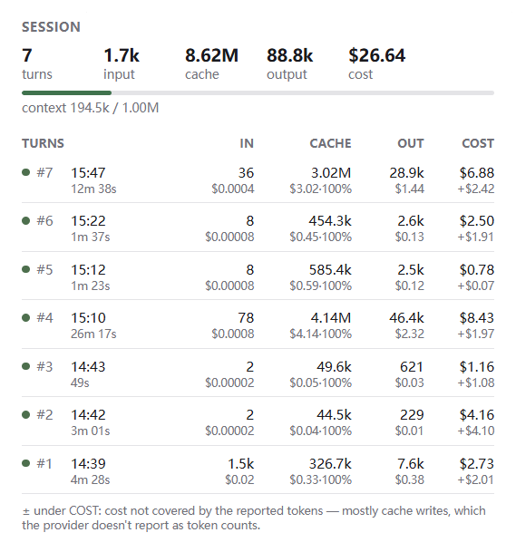
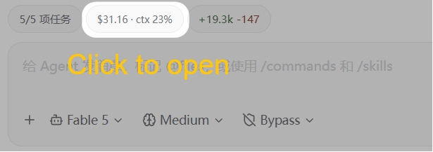

# TokenLedger

Per-turn LLM token usage and cost for [Paseo](https://paseo.sh) agents — an agent panel that records what each turn consumed, keeps a local history, and estimates cost when upstream omits it.

一个为 Paseo 提供**按轮（agent turn）**统计 token 用量的插件：面板实时显示进行中一轮的状态，每轮结束后固化一条账目，历史保存在本机。

<p align="center">
  
</p>

## What it shows

**Per-agent panel** (workspace/explorer, bound to one session — the header names the agent and model it is tracking):

- **Session summary** — total turns, input / cache / output tokens, and reported or estimated cost. Estimated totals use `≈`; missing-price turns are counted explicitly.
- **Turn in progress** — elapsed time, running token counts when available, and a context-window bar. When idle, the last known context-window usage is still shown.
- **Turn history** — one row per finished turn: status, time, duration, tokens, cost, and a data-quality mark.

**Composer pill** — every live agent gets a compact pill next to its composer (`$0.43 · ctx 47%`, with an activity icon while a turn is running). Pressing it opens that agent's panel. With split views, each session carries its own pill, so the session↔usage binding is always visible.

<p align="center">
  
</p>

**Overview** (sidebar → TokenLedger) — all sessions in one place: grand totals, then per-agent rows grouped by workspace with live-turn indicator, last activity, cost/tokens, and turn count. Tapping a row jumps to that agent.

**Timeline** — each newly finished turn gets one passive usage summary after its ledger record is saved. It uses the same normalized counts, cost source and quality marks as the panel. No polling or message replacement is involved.

## Compatibility

This branch targets **Paseo 0.8.x**, on both the daemon and the app. Paseo 0.7 users should stay on `v0.3.1`. Existing `ledger.jsonl` records remain readable; no migration or deletion is required.

## Install

```bash
git clone https://github.com/stv1024/token-ledger
cd token-ledger
npm install
paseo plugin install /absolute/path/to/token-ledger
```

Plugins must be enabled on the daemon (Settings → Plugins, or `pluginsEnabled: true` in `~/.paseo/config.json` followed by `paseo reload`). Plugins are trusted, unsandboxed code — read the source before installing, including this one.

Open any agent and pick the **TokenLedger** panel. Server lifecycle hooks start tracking when an interactive provider session opens or a turn starts, including CLI use without an app connected. Connecting an app also attaches the tracker to existing sessions.

## How turns are measured

A "turn" is one user message through to `turn_completed`, `turn_failed`, or `turn_canceled` — potentially spanning many model calls. Token counts always come from the provider; TokenLedger never invents missing usage:

| Situation | Value used | Quality |
| --- | --- | --- |
| Provider reports a whole-turn aggregate at turn end (Claude) | used as-is | `exact` |
| Provider reports per-request usage during the turn (Codex) | distinct observations summed | `partial` (shown as `≈`) |
| Only a single mid-turn observation | that observation | `partial` |
| Nothing reported | nothing shown | `unavailable` |

Cost uses the first available source: upstream reported cost, local override, OpenRouter reference pricing, then the small built-in fallback table. Claude reports cumulative session cost, so its per-turn delta is attributed to the turn. For unverified harnesses, raw cost is retained in `sessionCostUsd` but is not treated as a known per-turn charge. Model names do not establish aggregation or cost scope.

Estimated costs are marked `≈`. OpenRouter prices are references and may differ from the actual route or contract. New Codex records retain observed request counts, so tiered prices are chosen separately for each request. Historical records without request detail use the aggregate prompt as an approximate fallback.

Paseo 0.8.0 still omits Claude cache-write token counts. Reported cost includes them, so the residual under COST can be positive even when IN is small. Codex input includes cache reads; the UI subtracts those reads while the ledger retains raw counts. Identical consecutive usage snapshots cannot be distinguished from separate equal-size model calls, so Codex totals remain `partial`. Open-turn observations, session identity and billing baselines are checkpointed locally, and graceful plugin reloads preserve them. A crash can lose observations since the last checkpoint; events missed while the plugin was offline cannot be reconstructed. Interrupted recovered turns are marked as partial/unavailable rather than claiming an exact offline outcome.

When observed, the provider session ID is retained to distinguish billing resets from resumes. This optional field is compatible with existing v1 records.

### Pricing overrides

On first use, TokenLedger creates `~/.paseo/plugins/token-ledger/pricing.json` (or under `PASEO_HOME`). It is a USD-per-million-token table and has highest priority among estimates. Entries can be scoped by provider substring and can contain prompt-size tiers. Changes to the file are picked up on the next usage request after a 30-second recheck interval; a reload also applies them immediately:

```json
{
  "version": 1,
  "currency": "USD",
  "prices": [
    {
      "providers": ["my-provider"],
      "model": "my-model",
      "tiers": [
        { "input": 1.5, "cacheRead": 0.15, "output": 6 }
      ]
    }
  ]
}
```

OpenRouter's public model catalog is cached locally for 24 hours in `openrouter-pricing.json`. Local/cache prices are served before network refresh completes. If refresh fails, the last cache remains active, with retries no more often than every five minutes while the plugin is in use.

## Data & privacy

- Records only usage metadata: timestamps, agent ID, provider, model, token counts, cost, status, duration, quality. **Never** prompts, responses, tool arguments, file paths, or credentials.
- `tracker-state.json` is a separate atomic checkpoint containing open-turn observations and pending ledger writes. Stable IDs make recovery appends idempotent.
- Timeline summaries are a view of newly settled turns, not the authoritative history: Paseo keeps plugin timeline entries in daemon memory. No old entries are backfilled on restart, because appending would place them at the end and change activity ordering.
- Stored locally as JSON Lines at `~/.paseo/plugins/token-ledger/ledger.jsonl` (respects `PASEO_HOME`).
- Retention: the most recent 2,000 turns; older records are trimmed with an atomic rewrite.
- The only network request made by the plugin is a daily read of OpenRouter's public model-price catalog. No usage data is sent. History does not sync between machines.

## Support matrix

| Provider | Tokens | Cost |
| --- | --- | --- |
| Claude / claude-* variants | per-turn aggregate (`exact`) | reported when available; estimate fallback |
| Codex / codex-* variants | summed per-request (`partial`) | estimate fallback when absent |
| Other providers (OpenCode, Pi, ACP harnesses) | latest observation, `partial`; `unavailable` when silent | raw cost retained; estimate when model pricing matches |

## Development

```bash
npm install
npm run typecheck
npm test                      # node --test, no extra deps
paseo plugin reload token-ledger
paseo plugin logs token-ledger
```

Layout: `index.client.tsx` registers the UI; `index.server.ts` registers RPCs and lifecycle hooks. `client/` contains the panel, native button-descriptor pill, overview, and shared UI. `server/turns.ts` is the tested turn state machine, `server/tracker.ts` owns subscriptions and RPCs, `server/store.ts` serializes JSONL writes, and `server/pricing.ts` resolves prices. `shared/` contains RPC contracts, aggregation, pagination, and usage semantics.

## License

MIT
