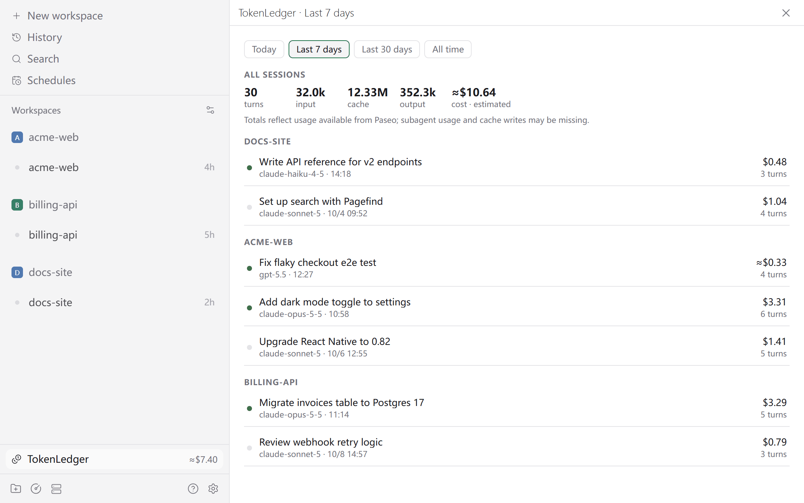

# TokenLedger

Per-turn LLM token usage and cost for [Paseo](https://paseo.sh) agents — an agent panel that records what each turn consumed, keeps a local history, and estimates cost when upstream omits it.

一个为 Paseo 提供**按轮（agent turn）**统计 token 用量的插件：面板实时显示进行中一轮的状态，每轮结束后固化一条账目，历史保存在本机。

<p align="center">
  <a href="https://github.com/stv1024/token-ledger/releases/download/v0.6.0/token-ledger-promo.mp4">
    
  </a>
  <br>
  <sub>▶ 20-second promo · <a href="promo/">source</a></sub>
</p>

<p align="center">
  
</p>

## What it shows

**Per-agent panel** (workspace/explorer, bound to one session — the header names the agent and model it is tracking):

- **Session summary** — total turns, input / cache / output tokens, and reported or estimated cost. Estimated totals use `≈`; missing-price turns are counted explicitly.
- **Turn in progress** — elapsed time, running token counts and estimated cost when available, and a context-window bar. When idle, the last known context-window usage is still shown.
- **Turn history** — one row per finished turn: status, time, duration, tokens, cost, and a data-quality mark.

**Composer pill** — every live agent gets a compact pill next to its composer (`$0.43 · ctx 47%`, with an activity icon while a turn is running). The total includes the current turn's estimated cost when available and uses `≈` whenever estimates contribute. Pressing it opens that agent's panel. With split views, each session carries its own pill, so the session↔usage binding is always visible.

<p align="center">
  
</p>

**Sidebar** — a **TokenLedger** row in the sidebar footer shows today's cost (or tokens when no price is known), with an activity icon while a turn is running. "Today" starts at local midnight on the device that shows it.

**Overview** (sidebar footer → TokenLedger, or the command center) — all sessions in one place: grand totals, then per-agent rows grouped by workspace with live-turn indicator, last activity, cost/tokens, and turn count. Pick **Today**, **Last 7 days**, **Last 30 days**, or **All time**; the range is part of the screen link and its title. A range lists agents with turns that ended in it, plus agents with a turn in flight. Tapping a row jumps to that agent.

<p align="center">
  
</p>

**Timeline** — each newly finished turn gets one passive usage summary after its ledger record is saved. It uses the same normalized counts, cost source and quality marks as the panel. No polling or message replacement is involved.

## Compatibility

TokenLedger **v0.7.0** requires **Paseo 0.11.0 or newer**, on both the daemon and the app, without an upper version limit. It uses the screen and sidebar footer APIs that Paseo 0.11 added. The verified host is **0.11.1**; allowing newer versions is not a claim that every future release has been tested. SDK development dependencies are pinned to 0.11.1, with CI checks against the minimum, the pin, and the latest published SDK. See the [compatibility policy and verification notes](docs/compatibility.md).

Paseo 0.9.1–0.10.x users should stay on `v0.6.3`; Paseo 0.8 users on `v0.5.1`; Paseo 0.7 users on `v0.3.1`. Existing `ledger.jsonl` records remain readable; no migration or deletion is required. See the [v0.6.0 release notes](docs/releases/v0.6.0.md) for the 0.9.1 migration details.

## Install

Install from the [Paseo plugin registry](https://paseo.sh/plugins/stv1024/token-ledger) (Paseo 0.11.0 or newer):

```bash
paseo plugin add stv1024/token-ledger
```

The registry installs the version its maintainers last reviewed, so a new release reaches it after review. To get the latest npm release directly:

```bash
paseo plugin install npm:paseo-token-ledger
```

Or paste either source into **Settings → Plugins → Plugin source**.

To install a tagged release from GitHub instead:

```bash
paseo plugin add github:stv1024/token-ledger --ref v0.7.0
```

Since Paseo 0.11, a bare `owner/name` source means the official plugin registry, which rejects `--ref`. Keep the `github:` prefix for Git installs. On Paseo 0.9.1–0.10.x, use `paseo plugin add stv1024/token-ledger --ref v0.6.3`.

Inspect or apply updates with:

```bash
paseo plugin update token-ledger --check
paseo plugin update token-ledger
```

Registry installations update to the registry's current reviewed version. npm installations update to the latest npm release. Git install selectors do not pin future updates: without an explicit `--ref`, Git updates follow the remote's default branch. Existing GitHub installations can keep updating from Git; switching to npm means `paseo plugin remove token-ledger` followed by the npm install (ledger data in `~/.paseo/plugins/token-ledger/` is kept). Local development installations use `paseo plugin reload token-ledger` after source changes.

Update both the daemon and app to a compatible Paseo version before updating the plugin. Check `paseo plugin ls` afterward; TokenLedger should be `running`. Reopen the desktop app if an existing window still shows an older plugin UI.

Plugins must be enabled on the daemon (Settings → Plugins, or `pluginsEnabled: true` in `~/.paseo/config.json` followed by `paseo reload`). Plugins are trusted, unsandboxed code — read the source before installing, including this one.

Open any agent and pick the **TokenLedger** panel. Server lifecycle hooks start tracking when an interactive provider session opens or a turn starts, including CLI use without an app connected. Connecting an app also attaches the tracker to existing sessions.

## Settings

Open **Settings → Plugins → token-ledger → TokenLedger** on the selected host:

- **Timeline summaries** controls summaries for newly finished turns; existing rows remain intact.
- **OpenRouter reference prices** controls both cached reference prices and background catalog refresh.
- **Built-in fallback prices** controls estimates when neither custom nor enabled OpenRouter pricing matches.
- **Refresh frequency** selects normal (3 seconds active / 30 seconds idle) or relaxed (10 / 60 seconds) fallback polling. Live updates still trigger refreshes.

Settings apply without a plugin reload and are shared by clients of that host. Reported costs and `pricing.json` overrides always retain priority. These preferences do not alter ledger retention or erase history.

All three switches default to on, and refresh frequency defaults to normal.

## How turns are measured

A "turn" is one user message through to `turn_completed`, `turn_failed`, or `turn_canceled` — potentially spanning many model calls. Token counts always come from the provider; TokenLedger never invents missing usage:

| Situation | Value used | Quality |
| --- | --- | --- |
| Provider reports a whole-turn aggregate at turn end (Claude) | used as-is | `exact` |
| Provider reports per-request usage during the turn (Codex) | distinct observations summed | `partial` (shown as `≈`) |
| Only a single mid-turn observation | that observation | `partial` |
| Nothing reported | nothing shown | `unavailable` |

Cost uses the first available source: upstream reported cost, local override, OpenRouter reference pricing, then the small built-in fallback table. Claude reports cumulative session cost, so its per-turn delta is attributed to the turn. For unverified harnesses, raw cost is retained in `sessionCostUsd` but is not treated as a known per-turn charge. Model names do not establish aggregation or cost scope.

Estimated costs are marked `≈`. OpenRouter prices are references and may differ from the actual route or contract. New Codex records retain observed request counts, so tiered prices are chosen separately for each request. Historical records without request detail use the aggregate prompt as an approximate fallback.

Paseo 0.9.1 still does not expose cache-write token counts through its public usage API. TokenLedger can retain and price them separately when supplied, but the current Claude and Codex adapters omit them. Missing counts stay unknown; historical writes are not inferred. Claude's reported total can include charges absent from the token counts, producing a positive residual under COST. Codex input includes cache reads (and cache writes when supplied); the UI separates known cache counts while the ledger retains raw counts.

Provider-internal subagents are not ordinary Paseo catalog agents. The public plugin API does not expose their usage; the Codex adapter discards child usage notifications. Session and overview totals therefore **may omit descendant usage**. TokenLedger uses only public Paseo APIs; it does not inspect provider logs or gateway billing endpoints. The [upstream API requirements](docs/paseo-usage-api.md) describe the missing fields, lineage, stable request IDs, and accounting scopes needed to close these gaps without double billing.

Identical consecutive usage snapshots cannot be distinguished from separate equal-size model calls, so Codex totals remain `partial`. Open-turn observations, session identity and billing baselines are checkpointed locally, and graceful plugin reloads preserve them. A crash can lose observations since the last checkpoint; events missed while the plugin was offline cannot be reconstructed. Interrupted recovered turns are marked as partial/unavailable rather than claiming an exact offline outcome. `exact` describes the reported turn aggregate, not proof that every descendant or billing category was included.

When observed, the provider session ID is retained to distinguish billing resets from resumes. This optional field is compatible with existing v1 records.

After a subscription error or reconnect, the tracker refreshes the affected agent and reconciles complete catalog snapshots. Affected turns retain `usageGap: true` and are shown with `gap`; a missed terminal outcome uses `status: "unknown"`. A cumulative cost spanning the gap is kept raw but is not assigned to one turn. Subsequent known billing baselines resume normal deltas. Recovery never invents missing requests or appends historical summaries to the Timeline.

### Pricing overrides

On first use, TokenLedger creates `~/.paseo/plugins/token-ledger/pricing.json` (or under `PASEO_HOME`). It is a USD-per-million-token table and has highest priority among estimates. Entries can be scoped by provider substring and can contain prompt-size tiers. Changes to the file are picked up on the next usage request after a 30-second recheck interval; a reload also applies them immediately:

```json
{
  "version": 1,
  "currency": "USD",
  "prices": [
    {
      "providers": ["my-provider"],
      "model": "my-model",
      "tiers": [
        { "input": 1.5, "cacheRead": 0.15, "cacheWrite": 1.875, "output": 6 }
      ]
    }
  ]
}
```

`cacheWrite` is an optional, independent USD/MTok rate; the example is illustrative, not a universal write multiplier. Old files remain valid: when a write count is known but its price is omitted, it uses the ordinary input rate as an estimate. An explicit zero is a free write rate. Missing write counts cannot be recovered by setting a price. Prompt-size tiers include ordinary input, cache reads, and known writes; reported total cost stays authoritative and is never increased by adding the estimated components again.

OpenRouter's public model catalog, including `input_cache_write` when provided, is cached locally for 24 hours in `openrouter-pricing.json`. Local/cache prices are served before network refresh completes. If refresh fails, the last cache remains active, with retries no more often than every five minutes while the plugin is in use.

Built-in Claude rates were checked against [Anthropic's pricing table](https://platform.claude.com/docs/en/about-claude/pricing) on 2026-09-23. Opus 5.5 standard rates are input $4, cache read $0.20, output $20 per million tokens; the cache-write reference is $5 for the 5-minute lifetime. Other lifetimes, Fast Mode, discounts and gateway contracts can differ. The public usage API does not identify cache lifetimes or the billed service tier. Unknown model versions and explicit Fast/Batch suffixes do not receive a guessed built-in price. Configure a matching override when needed; no new TokenRouter contract prices are assumed.

## Data & privacy

- Records only usage metadata: timestamps, agent ID, provider, model, token counts, cost, status, duration, quality. **Never** prompts, responses, tool arguments, file paths, or credentials.
- `tracker-state.json` is a separate atomic checkpoint containing open-turn observations and pending ledger writes. Stable IDs make recovery appends idempotent.
- Timeline summaries are a view of newly settled turns, not the authoritative history: Paseo keeps plugin timeline entries in daemon memory. No old entries are backfilled on restart, because appending would place them at the end and change activity ordering.
- Stored locally as JSON Lines at `~/.paseo/plugins/token-ledger/ledger.jsonl` (respects `PASEO_HOME`).
- Retention: the most recent 2,000 turns; older records are trimmed with an atomic rewrite.
- When OpenRouter reference prices are enabled, the plugin reads the public model-price catalog and caches it for 24 hours. No usage data is sent. History does not sync between machines.

## Limitations

- Paseo 0.9.1 does not expose cache-write token counts; Claude cache writes are invisible in token columns (reported cost stays accurate, the gap shows as a `+$x.xx` residual).
- Usage of provider-internal subagents is not exposed by Paseo, so session and overview totals may omit it.
- Codex totals are summed per request and marked `partial` (`≈`); estimated costs use reference prices and may differ from your actual contract.
- Events missed while the plugin or daemon was offline cannot be reconstructed; affected turns are marked `gap` / `unknown`.
- Desktop and mobile UI were verified less thoroughly than the daemon side.

## Support matrix

| Provider | Tokens | Cost |
| --- | --- | --- |
| Claude / claude-* variants | per-turn aggregate (`exact`) | reported when available; estimate fallback |
| Codex / codex-* variants | summed per-request (`partial`) | estimate fallback when absent |
| Other providers (OpenCode, Pi, ACP harnesses) | latest observation, `partial`; `unavailable` when silent | raw cost retained; estimate when model pricing matches |

## Development

```bash
git clone https://github.com/stv1024/token-ledger
cd token-ledger
npm install
paseo plugin install /absolute/path/to/token-ledger
npm run typecheck
npm test                      # node --test, no extra deps
paseo plugin reload token-ledger
paseo plugin logs token-ledger
```

Layout: `paseo-plugin.json` declares the registry name, icon, and screenshots, and `OVERVIEW.md` is the registry listing page (no install commands; the registry rejects them). `index.client.tsx` registers the UI; `index.server.ts` registers RPCs and lifecycle hooks. `client/` contains the panel, native button-descriptor pill, overview screen, sidebar footer row, and shared UI. Shipped code takes Paseo client types only from the host SDK (`client/paseo-types.ts`, `server/paseo-types.ts`), so Git and npm installs need no dependencies. `server/turns.ts` is the tested turn state machine, `server/tracker.ts` owns subscriptions and RPCs, `server/store.ts` serializes JSONL writes, and `server/pricing.ts` resolves prices. `shared/` contains RPC contracts, aggregation, pagination, and usage semantics.

## License

MIT
